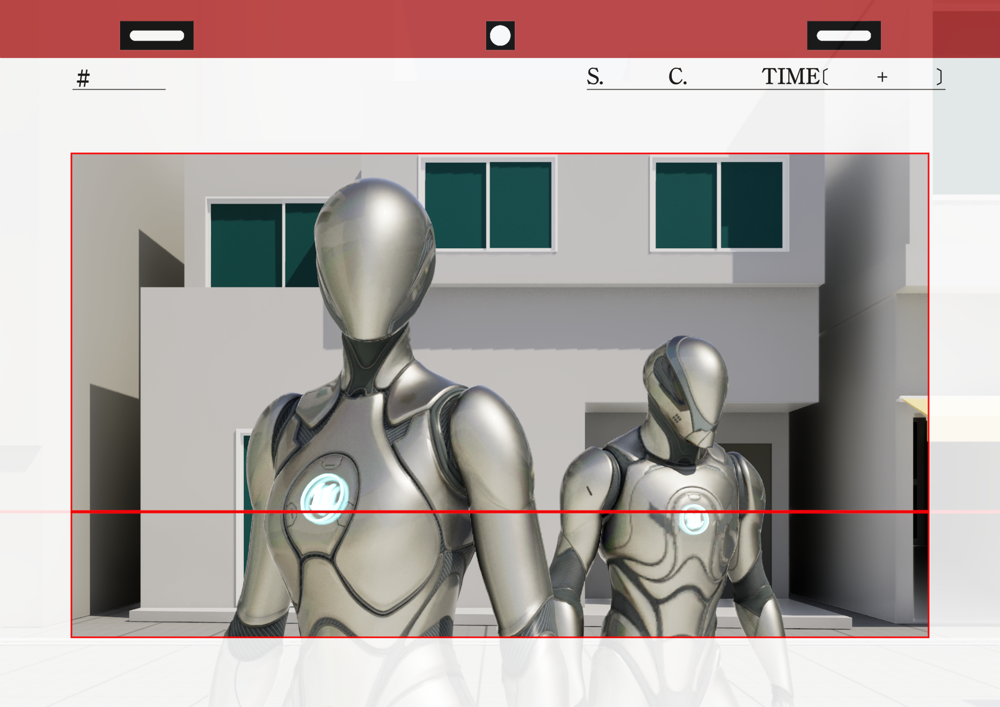
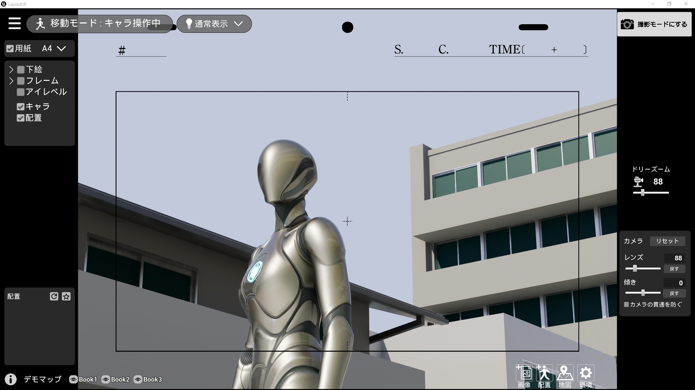
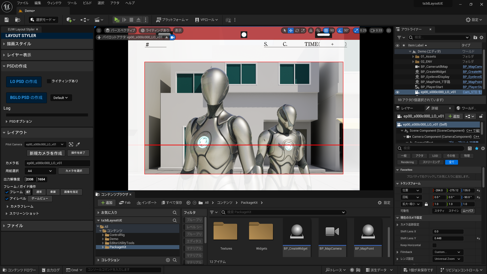

# TOEI-ANIMATION-3D-Layout-UE

# 概要

TOEI-ANIMATION-3D-Layout-UEは、Unreal Engine 5を使用してアニメ制作向けの3Dレイアウトを作成できるツールキットです。  
本ツールには エディタ版とパッケージ版 の2種類があり、用途に応じて使用できます。

* エディタ版  
  * UE5エディタ内で3Dレイアウト作成が可能になるエディタ拡張ツール  
  * UE5の機能と合わせることで高度なレイアウト編集が可能  
  * 主にCGスタッフの使用を想定  
* パッケージ版  
  * UE5のゲーム開発機能で作成するスタンドアロンアプリケーション  
  * 簡単な操作で3Dレイアウトを作成し画像やカメラデータの出力が可能  
  * 演出、作画、背景、製作など幅広いスタッフの使用を想定  
  * ひとつのステージにつき、ひとつのアプリケーションとして運用

# リポジトリ内容

このリポジトリには以下のデータが含まれています。

* UE5.3プロジェクト  
  * エディタ版3Dレイアウト作成ツール  
  * パッケージ版作成キット  
* パッケージ版デモ（Windows 64bit）  
* マニュアル（PDF）

# 本ツールの運用方法

* エディタ版  
  * UE5を扱うデザイナーが背景モデルをプロジェクト内に作成  
  * プロジェクトをCGスタッフに共有し、レイアウト作業に使用する  
* パッケージ版  
  * UE5を扱うデザイナーが背景モデルごとにパッケージ版を作成  
  * 制作スタッフに配布し、モデルの閲覧やレイアウト作業に使用する

詳細な手順についてはマニュアルをご覧ください。

# パッケージ版を体験する

本ツールキットを使用して作成されたパッケージ版アプリケーションのデモを同梱しています。  
デモ用の背景モデルでパッケージ版の動作を実際にお試しください。  

パッケージ版ダウンロードリンク
https://github.com/ToeiAnimation/ToeiAnimation-3D-Layout-UE/releases/download/ta3DLayoutUE-1.0.0/ta3DLayoutUE.DEMO.zip

# プロジェクトを使用する

UE5プロジェクトを使用することで、エディタでの3Dレイアウトの作成や、パッケージ版アプリケーションを作成することができます。  
作品やプロダクションの用途に合わせてカスタマイズしてご使用ください。  

# 動作環境

* Unreal Engine のバージョンは 5.3.2 を想定しています。  
* パッケージ化の際はVisual Studio 2022 の利用を想定しています。  
* パッケージ版デモはWindows向けに作成しています。

# 注意事項

* 本リポジトリの内容は予告なく変更・削除する可能性があります。
